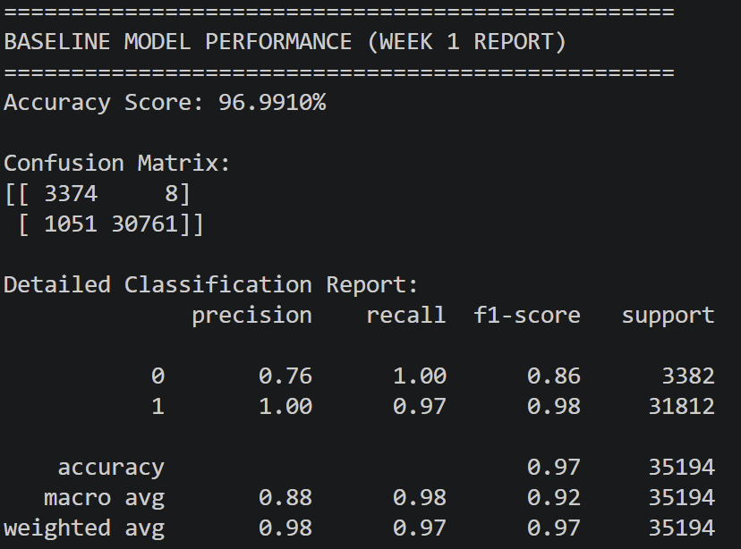

# 🛡️FinSecure AI: Quantitative Risk & Adversarial Resilience
**AI-driven Fraud Detection with Financial Loss Quantification**
- Most AI models only predict fraud; FinSecure AI calculates its price. This project bridges the gap between machine learning and financial risk management by simulating adversarial attacks and translating them into clear business metrics like Expected Loss (€) and Tail Risk. Through an interactive dashboard, we empower banks and fintechs to move from simple detection to data-driven risk mitigation and ROI-focused decision making.

### Purpose & Impact
* **Proactive Defense:** Moving from passive monitoring to real-time risk simulation.
* **Loss Quantification:** Translating model failure into monetary impact (Tail Risk & Mitigation ROI).
* **Adversarial Resilience:** Stress-testing fraud engines against sophisticated, evolving attacks.
* **Decision Support:** An interactive dashboard designed for the C-suite to empower data-driven decisions.

## Week 1: High-Fidelity Foundation
In the first phase, we successfully simulated a realistic fintech environment and established a robust baseline detection system.

### 📊 Baseline Performance
- Our model, built on **XGBoost**, has been optimized to handle the extreme class imbalance typical of financial fraud.
* **Accuracy:** 96.99%
* **CV F1-Score (Weighted):** 0.9718
* **Fraud Detection F1-Score:** 0.98
* **Customer Friction:** Extremely low (Only 8 false positives out of ~35k test samples).

### 📈 Performance Visualization
- Below is the official output from our baseline model, showcasing the precision-recall balance and the confusion matrix.

## Technical Implementation
* **Realistic Simulation:** Uses Log-normal distribution for transaction amounts and pattern-based fraud injection (Salami attacks, Velocity attacks).
* **Advanced Preprocessing:** Robust scaling to handle financial outliers and categorical encoding for transaction types.
* **Model Engine:** XGBoost with `scale_pos_weight` for handling imbalanced datasets.

## 📁 Repository Structure
* `data/`: Data generation and preprocessing scripts.
* `model/`: ML model definitions and training logic.
* `assets/`: Visual evidence and performance reports.
* `requirements.txt`: Project dependencies.

## 🗓️ What's Next?
* **Week 2:** Adversarial Attacks - Simulating sophisticated fraud patterns to bypass the baseline model.
* **Week 3:** Financial Loss Quantification - Calculating the monetary impact of undetected fraud.